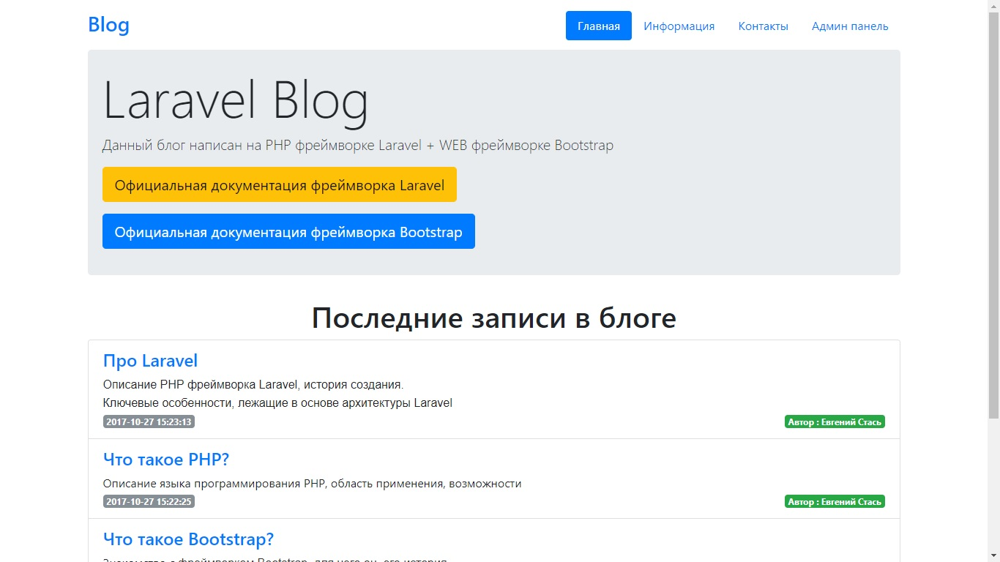

# A simple blog on the Laravel framework + Twitter Bootstrap

## Blog can : 
- Display last 10 publications on main page of site with title, description, date of creation and author
- Show full publication on new page with title, text, date of creation, author and count of views
- Display information of blog : count of publications, the most popular publication of views and author this publication, last changing publication of date
- Contact with site administration with help email, with saving information in database

## The site administration can :
- Entrance in panel of administration with email and password
- Public registration a new user with email and password
- Restore password if user forgot
- Add new publication with title, description, full text with WYSIWYG HTML Editor and with saving the author publication
- Edit publication with WYSIWYG HTML Editor and with saving the author publication and date of changing
- Deleting publications

## As frontend use the last version of Twitter Bootstrap

# Laravel PHP Framework

Laravel is a web application framework with expressive, elegant syntax. We believe development must be an enjoyable, creative experience to be truly fulfilling. Laravel attempts to take the pain out of development by easing common tasks used in the majority of web projects, such as authentication, routing, sessions, queueing, and caching.

Laravel is accessible, yet powerful, providing tools needed for large, robust applications. A superb inversion of control container, expressive migration system, and tightly integrated unit testing support give you the tools you need to build any application with which you are tasked.

## Official Documentation

Documentation for the framework can be found on the [Laravel website](http://laravel.com/docs).

## Contributing

Thank you for considering contributing to the Laravel framework! The contribution guide can be found in the [Laravel documentation](http://laravel.com/docs/contributions).

## Security Vulnerabilities

If you discover a security vulnerability within Laravel, please send an e-mail to Taylor Otwell at taylor@laravel.com. All security vulnerabilities will be promptly addressed.

## License

The Laravel framework is open-sourced software licensed under the [MIT license](http://opensource.org/licenses/MIT).
